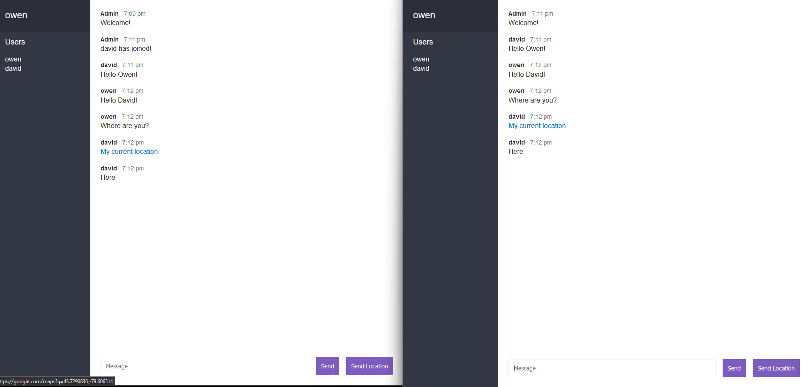

# chat-app

Chat app for Full Stack assignment 2

---

## To run application

1. Open file in your code editor
2. In the terminal install node modules with "npm i"
3. Run application with "npm run dev"
4. Open application in your web browser by going to "localhost:3000"

## How to use

1. Enter your desired display name in the "Display Name" input field
2. Enter any room name in the "Room Name" input field
3. Click "Join"
4. Open a new browser tab or window and navigate to "localhost:3000"
5. Enter your desired display name
6. Enter the same room name you used in step 2.
7. Click "Join"
8. Both users should now be in the same room and be able to send messages to each other
9. To share location press the "Send Location" button
10. Allow the browser to use your location
11. A link will appear in the chat window
12. Clicking the link will take you to Google maps with a pin showing your chat partners current location

